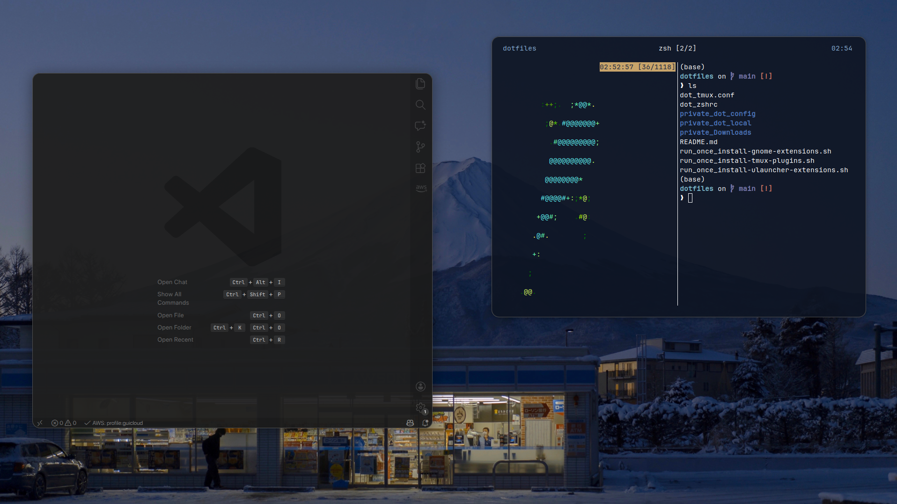

# dotfiles
Meu setup para sistemas unix

---

## Setup
Feito com [`chezmoi`](https://github.com/twpayne/chezmoi).

## Info

- Distro: `Ubuntu`
- Terminal Emulator: `Alacritty`
- Editor: VSCode
- Font: `JetBrainsMono Nerd Font`
